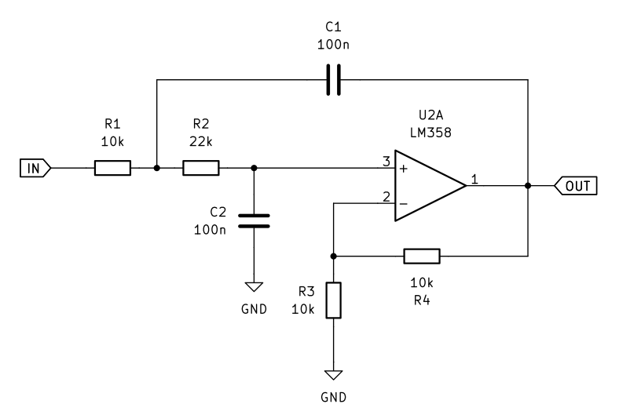

# Speedometer Drive

The speedometer is an analogue servo motor with three terminals, COM, SIN, COS. 
The angular position is determined by the applied DC voltage between COM and SIN, and COM and COS terminals.

A timer with 3 PWM channels is used for DC signal generation. The PWM signal is filtered using a low-pass. 
Non-inverting amplifiers are used for attenuation of the signals from 3.3 V to 6.6 V. 

# Schematic

A non-inverting operation amplifier circuit with second-order low-pass is used.

$K = 1 + \frac{R_3}{R_4}$

$f_C = \frac{1}{2 * \pi * R_1 * C_1 * R_2 * C_2}$

## Component Values (E12 Series)

For $f_c \approx 100$ Hz and $C_1 = C_2 = 100$ nF (E6):

*   $R_1 = 10$ k$\Omega$
*   $R_2 = 22$ k$\Omega$

This results in $f_c \approx 107$ Hz.

